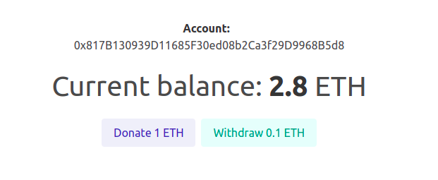

### Faucet Example
This a simple ether faucet. It was created using ganache and truffle so it's not working on some testnet chain.

### Steps to run the project
- Clone the repository and run the yarn command;
- Install ganache on your computer;
- On ganache select the "New Workspace" option and add this project by selecting the truffle-config.js;
- Install truffle as global with the command: yarn global add truffle;
- To deploy our contracts run truffle migrate;
- Install metamask extension in your browser;
- On metamask add your ganache network using the url "HTTP://127.0.0.1:7545" and chain id "1337";
- Import one of your ganache accounts into metamask using the private key;
- Run yarn start.
